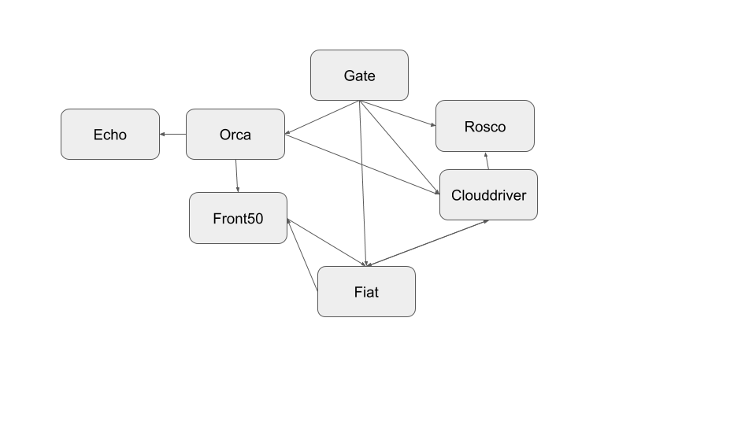

This set of configs are meant to help [Spinnaker](http://spinnaker.io) developers isolate specific services for local development, while keeping the rest of the services up and available on a remote VM.

Prior to this, a developer would usually have to launch at least one "downstream" service as a dependency of the service he would like to make a change to. With the proper setup, a dev need only run the service-under-development locally.

As with most things in computer science, the solution is to add another layer of indirection. In this case, I'm introducing an `nginx` proxy between all inter-service communication. The `nginx` proxy config defaults to forwarding the request to the service living on the VM. A developer must tweak _which_ service is under development by modifying the `nginx` config to point to a reverse-tunneled port.

### Before


### After


## Prerequisites

1. A remote VM with each of the services running on it. Assuming you're a developer, you probably want the source code versions (as opposed to the pre-built Debian packages). Halyard setup to deploy to a [Local Git](https://www.spinnaker.io/setup/install/environment/#local-git) environment works very nicely to do this.
    > A remote Kubernetes environment would be great for this as well. Unfortunately, `kubectl port-forward` doesn't [yet support reverse port-forwarding](https://github.com/kubernetes/kubernetes/pull/57320), which is needed to make this solution work.

1. Redis installed on your local workstation. While it's possible to port-forward Redis as well, services like Orca and Clouddriver share work by locking specific keys in a shared Redis. To ensure your work is completely contained locally, your local **system-under-development (SUD)** should have it's own Redis.

## Setup

1. SSH to VM with tunnel options. Port `8000` is the proxy's port, and `8005` is what the SUD should bind to. In GCP, this could look like:
	```
	gcloud compute ssh my-spinnaker-vm -- -L 8000:localhost:8000 -R 8005:localhost:8005
	```

1. From the home directory, clone this repo: `git clone https://github.com/ttomsu/spinnaker-dev-proxy.git dev/spinnaker-dev-proxy && cd dev/spinnaker-dev-proxy`

1. `sudo apt-get install nginx`

1. ``sudo ln -s `pwd`/etc/nginx/sites-enabled/dev-proxy.conf /etc/nginx/sites-enabled/``

1. ``sudo nginx -t && sudo nginx -s reload``

1. Sanity check: `curl localhost:8000/clouddriver/credentials` or `curl localhost:8000/orca/health`

1. ``ln -s `pwd`/hal/default/service-settings/* $HOME/.hal/default/service-settings/``

1. ``ln -s `pwd`/hal/default/profiles/* $HOME/.hal/default/profiles/``

1. Relaunch all services: `hal deploy apply`. Once all services are back up, you should be able to see all traffic between all services in the `/var/log/nginx/access.log` file.


On your local workstation, you should now be able to navigate to `http://localhost:8000` and the Spinnaker UI should appear (after a redirect to `/ui/`)


## Developing a service

1. On the VM, edit `/etc/nginx/sites-enabled/dev-proxy.conf`. Comment out the existing `proxy_pass` entry of the SUD, and uncomment the entry that `proxy_pass`es to port `8005`

1. Clone this repo to your local workstation. Link a copy of `spinnaker-local.yaml` to your `$HOME/.spinnaker` directory: ``mkdir -p $HOME/.spinnaker && ln -s `pwd`/hal/default/profiles/spinnaker-local.yaml $HOME/.spinnaker/``

1. Bring up Intellij project for the SUD. Create a new **Run Configuration**
	1. If you have the paid Intellij version, this Run Configuration can be a Spring Boot one, or
	1. If you have the free Intellij Community edition, create a new Gradle Run Configuration.

1. Name it something like `bootRun-8005`
	1. Gradle project: "SUD:SUD-web"
	1. Tasks: "bootRun"
	1. Environment variables: `SERVER_PORT=8005`
	1. Check "Single Instance Only"

1. Execute the Run Configuration. The server should startup on port 8005. You may start to see traffic to `http://localhost:8000/some-service/path/for/that/service`.

1. Iterate on your local instance!


### Known Issues

* Deck's `webpack-dev-server` continuously attempts to send web traffic to `localhost:8000/ui/info?ts=12345` which is not a valid location. It's a [known bug](https://github.com/webpack/webpack-dev-server/issues/1021) when you introduce a proxy in front of webpack-dev-server


